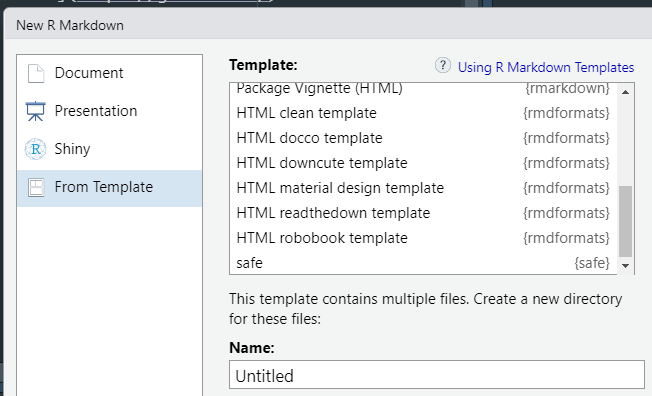

<!-- README.md is generated from README.Rmd. Please edit that file -->

# safe

<!-- badges: start -->
<!-- badges: end -->

The goal of safe is to create formally structured set of .Rmd files to
produce a SAFE report.

## Installation

You can install the development version of safe from
[GitHub](https://github.com/) with:

``` r
# install.packages("devtools")
devtools::install_github("BenWilliams-NOAA/safe")
```

## Example

Once `safe` is installed on your machine open a new .Rmd file, click on
the “From Template” find the one that is called `safe`, give it a good
name and the suite of .Rmd files will be placed in the folder. \*Note
that there is also one called `partial_safe`, use whichever is
appropriate for your needs.

``` r
knitr::include_graphics(here::here('man', 'figures', 'README-template.PNG'))
```


